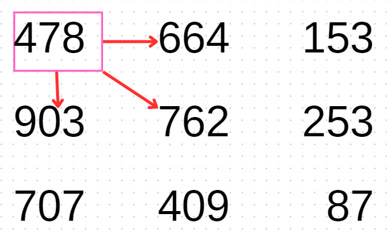
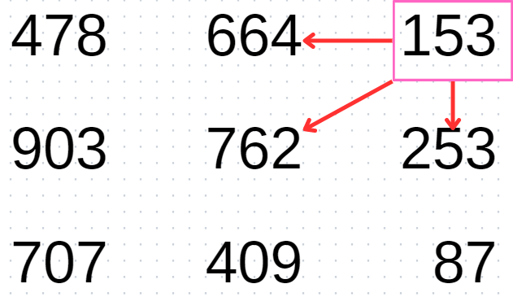
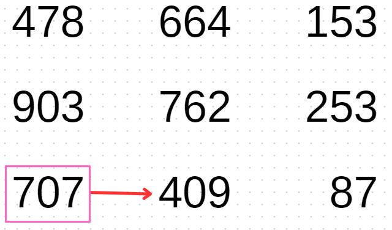
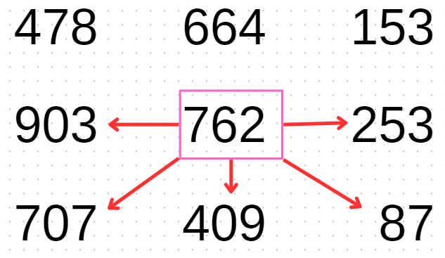
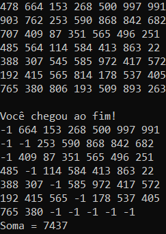

# AEDS: Caminho Guloso
 </br>

## Objetivo
Ler e caminhar por um conjunto de matrizes de inteiros. Em cada matriz, o ponto de partida é definido através da leitura de um arquivo e o ponto final é o número localizado na última linha da última coluna da matriz. </br>
Para escolher onde deve-se andar, é necessário analisar os números ao redor da posição atual, não considerando ir para trás ou para caminhos já percorridos, e caminhar em direção ao número maior. Assim, é possível trabalhar o conceito de caminhamento de matrizes de forma gulosa.

## Arquivos
* Dados
  * ```posicaoInicial.data```: indica a posição do caminhamento, na primeira linha do arquivo há o número referente à linha da posição inicial e na segunda linha, a coluna da posição inicial;
  * ```input.data```: contém as matrizes;
* Source
  * ```funcoes.hpp```: implementação das funções necessárias para o funcionamento do código;
  * ```main.cpp```: chamada das funções e criação das variáveis estáticas;
* Compilação
  * ```makefile```: automatiza a compilação dos arquivos.
  
## Variáveis importantes
*Todas estão inicializadas em ```main.cpp```*
* "N" (int): tamanho das matrizes, lido a partir da primeira linha do ```input.data```;
* "linhaInicio" e "colunaInicio" (int): indicam a posição inicial, lidas de ```posicaoInicial.data```;
* "nMatrizesArquivo" (int): através de uma função (```int contarLinhasVazias(ifstream arquivo)```), obtém-se o número de matrizes contidas em ```input.data```;
* "somaFinal" (int): soma dos caminhos percorridos nas matrizes;
* "arquivo" e "arquivoPosicaoInicial" (ifstream): objetos associados ```input.data``` e ```posicaoInicial.data```, respectivamente;
* "matrizTxt" (string **): matriz onde o que foi lido de ```input.data``` é salvo;
* "matrizInt" (int **): "matrizTxt" convertida para inteiro.

## Funções - Manipulação de arquivos e matrizes
* ```int determinarLinhaInicio(ifstream& arquivo)```: Lê a primeira linha de ```posicaoInicial.data``` e retorna a linha da posição inicial;
* ```int determinarColunaInicio(ifstream& arquivo)```: Lê a segunda linha de ```posicaoInicial.data``` e retorna a coluna da posição inicial;
* ```int lerPrimeiraLinha(ifstream &arquivo)```: Lê a primeira linha de ```input.data``` e retorna o tamanho das matrizes;
* ```int contarLinhasVazias(ifstream& arquivo)```: Conta as linhas vazias de ```input.data``` e retorna a quantidade de matrizes;
* ```void lerMatrizArquivo(string ** matrizTexto, ifstream &arquivo, int N)```: Lê uma matriz de ```input.data```, ignorando os caracteres ```' '``` e '\0', e a salva na "matrizTxt";
* ```void converterStrParaInt(string ** matrizTexto, int ** matrizInt, int N)```: converte a "matrizTxt" para a "matrizInt", usando a função ```atoi()```;
* ```void imprimirMatrizInt(int ** matriz, int N)``` e ```void imprimirMatrizTxt(string ** matriz, int N)```: percorrem as matrizes de texto e de inteiro, imprimindo-as no terminal.

## Funções - Decisão de caminhamento
* ```int posicaoMaiorValor(vector<int> vetor)```: percorre um vector e retorna a posição do maior valor;
* ```int ondeAndar(int ** matriz, int linhaAtual, int colunaAtual, int N)```: Adiciona os valores das possíveis posições de destino em um vector, usa a função ```posicaoMaiorValor``` para ver qual posição possui maior valor e retorna um inteiro que indica a direção de caminhamento
  * Para inserir no vector, a posição deve ser diferente de -1, valor que marca uma posição já processada. Caso a posição tenha -1 como valor, este é inserido no vector, de modo a respeitar a quantidade de caracteres a serem comparados. A inserção desse valor no vector não afeta a procura do maior valor.
  * Retornos:  1 - Direita, 2 - Esquerda, 3 - Para baixo, 4 - Diagonal direita, 5 - Diagonal esquerda, 10 - Fim;
* ```int andar(int ** matriz, int N, int linhaAtual, int colunaAtual)```: A partir do inteiro retornado da função ```ondeAndar```, realiza, de fato, o caminhamento.
  * Formas de caminhar:
    * Direita: Incrementar 1 na coluna;
    * Esquerda: Decrementar 1 na coluna;
    * Para baixo: Incrementar 1 na linha;
    * Diagonal direita: Incrementar 1 na linha e na coluna;
    * Diagonal esquerda: Incrementar 1 na linha e decrementar 1 na coluna.
  * A cada caminhamento, a incrementa-se a variável da soma do caminho percorrido. No final de cada matriz, esse valor é retornado para ser incrementado na soma final.

## Caminhamento
*Como o objetivo é chegar na última linha da última coluna, em todos os casos descritos abaixo, caso a posição atual seja na última linha, a única possibilidade de caminhamento é para a direita.*</br>
*A ordem de inserção no vector é muito importante. Caso duas ou mais possibilidades de caminhamento tenham valor igual, a posição do valor da possibilidade que foi inserida no vetor primeiro será a escolhida para caminhar.*</br>
**Caso 1 - Coluna atual = 0**</br>
* Possibilidades de caminhamento:</br></br>
</br></br>
* Ordem de inserção no vector: direita, diagonal direita e para baixo.</br>

**Caso 2 - Coluna atual = N - 1**
* Possibilidades de caminhamento:</br></br>
</br></br>
* Ordem de inserção no vector: para baixo, esquerda e diagonal esquerda.</br>

**Caso 3 - Linha atual = N - 1**
* Possibilidades de caminhamento:</br></br>
</br></br>
* Não há inserção no vetor, a próxima posição obrigatoriamente é a direita.

**Caso 4 - Não está na última linha, nem na última coluna, nem na primeira coluna**
* Possibilidades de caminhamento:</br></br>
</br></br>
* Ordem de inserção no vector: direita, diagonal direita, para baixo, esquerda e diagonal esquerda.

## Resultados 
</br></br>
O código funciona da mesma maneira para uma quantidade "n" de matrizes contidas no arquivo ```input.data```, ou seja, toma as mesmas decisões de caminhamento para qualquer matriz que for lida. No final, ainda, é informado ao usuário a soma total do caminhamento das "n" matrizes.
 
## Considerações finais
* As funções ```lerMatrizArquivo```, ```converterStrParaInt``` e ```andar``` são chamadas dentro de um ```for``` que roda de acordo com o número de matrizes existentes no ```input.data```, pois elas tratam uma matriz por vez;
* Após as manipulações, a memórias das matrizes são liberadas e os arquivos são fechados.
* Especificações da máquina em que o código foi rodado:
  * Processador Intel Core i5, 7th Gen;
  * Sistema Operacional Windows 10;
  * Terminal do WSL: Ubuntu 20.04.5;
  * 8GB de RAM.
* | Comando                |  Função                                                                                           |                     
  | -----------------------| ------------------------------------------------------------------------------------------------- |
  |  `make clean`          | Apaga a última compilação realizada contida na pasta build                                        |
  |  `make`                | Executa a compilação do programa utilizando o gcc, e o resultado vai para a pasta build           |
  |  `make run`            | Executa o programa da pasta build após a realização da compilação                                 |